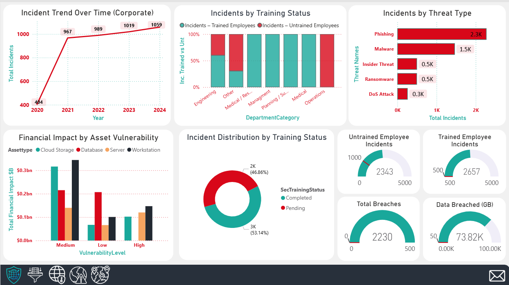

# Cybersecurity Risk Intelligence — Business Intelligence with Power BI



**Course:** Business Intelligence for Data-Driven Management  
**Program:** MSc IT for Business Data Analytics — IBS Budapest  
**Author:** Mohammadali Ghaderi

---

## 1. Project Overview

This project delivers a multi-layered **Business Intelligence (BI)** analysis of cybersecurity risk using **Power BI**.  
The work combines dashboard design, risk-oriented KPIs, and executive storytelling to support **data-driven management decisions** in a cybersecurity context.

The project emphasizes:
- integrating multiple public data sources,
- designing interpretable dashboards,
- communicating insights to non-technical stakeholders,
- supporting strategic and operational decision-making.

**Deliverables included:**
- Power BI dashboard (`.pbix`)
- Presentation (`.pptx`)
- Written report (DOCX + PDF)

---

## 2. Dashboard Pages (Power BI)

The Power BI dashboard contains four main pages:

1. **Corporate Cyber Dashboard**  
2. **Global Threats Dashboard**  
3. **Global Risk Dynamics Dashboard**  
4. **Global Maps Dashboard**

Exported dashboard screenshots are available for preview in:

```

dashboards/exports/

````

---

## 3. Repository Structure

```text
business-intelligence-cybersecurity-risk/
├─ dashboards/
│  ├─ powerbi/                 # Power BI (.pbix) file
│  └─ exports/                 # dashboard screenshots (PNG)
├─ presentation/               # presentation deliverable (PPTX)
├─ report/
│  └─ final/                   # written report (DOCX + PDF)
├─ data/
│  ├─ raw/                     # included CC0 datasets
│  └─ README_data.md           # dataset references and notes
└─ docs/
   ├─ AI_USAGE.md
   └─ ACADEMIC_INTEGRITY.md
````

---

## 4. Data

The datasets used in this project are **included in the repository** under:

```
data/raw/
```

All datasets originate from publicly available **Kaggle** sources and are released under **CC0 (Public Domain)** licenses, which permit redistribution and reuse.

Detailed dataset descriptions, file lists, and source references are provided in:

* `data/README_data.md`

No personal, confidential, or sensitive information is contained in the data.

---

## 5. How to View the Dashboard

### Option A — Open the Power BI file (recommended)

1. Install **Power BI Desktop** (Windows).
2. Open the dashboard file:

```
dashboards/powerbi/cybersecurity_risk_dashboard.pbix
```

3. Navigate through the four dashboard pages listed above.

### Option B — View exported screenshots

If Power BI Desktop is not available, you can review static dashboard previews in:

```
dashboards/exports/
```

---

## 6. Academic Integrity and AI Disclosure

This repository is published for **academic demonstration and portfolio purposes**.

* AI usage disclosure: `docs/AI_USAGE.md`
* Academic integrity statement: `docs/ACADEMIC_INTEGRITY.md`

Grades, rubrics, and instructor feedback are intentionally excluded.

---

## 7. Notes

* The Power BI file does **not** contain private credentials, embedded tokens, or personal identifiers.
* The focus of this repository is on **business intelligence design, interpretation, and communication**, rather than raw data collection.
* All analytical transformations are implemented within Power BI.
